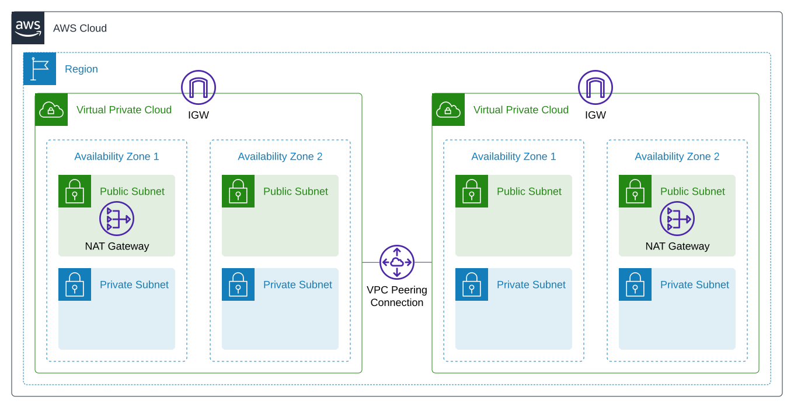

## Overview
This repository contains code and resources for creating and deploying infrastructure on AWS using the AWS Cloud Development Kit (CDK). The code in this repository is specifically designed to make it easy for users to quickly set up multiple VPCs that are privately interconnected. 

## Prerequisites
- An AWS account and credentials
- Node.js and the AWS CDK Toolkit installed
- Python 3.6 or later
- The Python package installer (pip) and virtual environment manager (virtualenv)

## Usage
This application is implemented using the AWS CDK. In order to deploy the cloud resources, a context must be provided to the CDK application. Here is an example of how to configure and deploy the resources for this application. 

The `cdk.context.json` file, which is located at the root level of the repository, is used to provide configuration options to the CDK stack. An example of its usage is shown below:
```
{
    "stack_name":"VPCPeeringPoC",
    "vpcs":{
        "vpc1":{
            "cidr":"10.0.0.0/16",
            "max_azs":2,
            "nb_nat_gateways":1,
            "private_subnets_with_egress":true
        },
        "vpc2":{
            "cidr":"10.1.0.0/16",
            "max_azs":2,
            "nb_nat_gateways":1,
            "private_subnets_with_egress":true
        }
    }
}
```

The `stack_name` attribute must be specified to provide a name for the CloudFormation root stack. This value will be used to identify the stack in the AWS management console and in other AWS tools. 

The `vpcs` object contains configuration options for two Virtual Private Clouds (VPCs), named "vpc1" and "vpc2". It is important to note that the current implementation of this CDK project requires exactly two VPCs to be configured, and that these VPCs will be privately interconnected using a VPC peering connection. For each VPC, the following options are provided:

- `cidr`: The CIDR block for the VPC.
- `max_azs`: The maximum number of Availability Zones (AZs) to use for the VPC.
- `nb_nat_gateways`: The number of NAT gateways to create for the VPC.
- `private_subnets_with_egress`: A boolean value indicating whether private subnets in the VPC should have internet egress enabled.

These configuration options can be used to customize the behavior of the CDK stack when it is deployed. For example, the VPC CIDR blocks and the number of NAT gateways can be adjusted to fit the needs of the specific environment in which the stack is being deployed.

To deploy the configured cloud resources, run the following command:
```
cdk deploy
```

## Architecture
The application deploys two VPCs and connects them using a VPC peering connection. The following diagram illustrates the architecture:


## Clean-up
To clean up the stack, you can use the cdk destroy command as shown below:
```
cdk destroy
```
This command will delete all resources that were created by the stack. Failing to delete resources such as NAT Gateways can result in ongoing charges for their usage. 

## License
The project is licensed under the MIT license, which allows users to use, modify, and distribute the project's code and documentation for any purpose, as long as the original copyright and license notice is included.